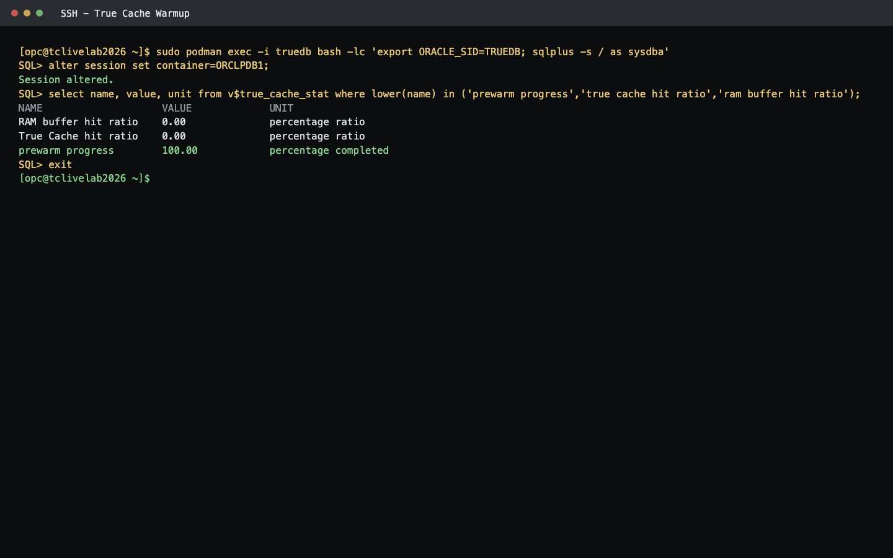

# Prepare and Warm True Cache

## Introduction

In this lab, you will work with the preloaded transaction schema, apply True Cache KEEP, and warm True Cache.

The DBW26 environment is already provisioned. You do not need to create the transactions user, create tables, or populate seed data.

*Estimated Time:* 20 minutes

<if type="nonsandbox">
Watch the video for a quick walk through of the Lab2.
[Lab2](videohub:1_mz228rvo)
[Lab2](videohub:1_yayzolzj)
</if>

### About Oracle True Cache
Modern applications often require massive scalability in terms of both the number of connections and the amount of data that can be cached.

Oracle True Cache satisfies queries by using only data from its buffer cache. Like Oracle Active Data Guard, True Cache is a fully functional, read-only replication of the primary database, except that it is mostly diskless.

### Objectives

In this lab, you will:
* Validate the preloaded transactions schema.
* Apply KEEP to selected objects.
* Warm True Cache through the Java client application.
* Check True Cache warmup and hit-ratio evidence.

### Prerequisites (Optional)

This lab assumes you have:
* An Oracle Cloud account
* All previous labs successfully completed

## Task 1: Review Preloaded Transaction Objects



1. Validate that the transaction tables already exist in the Primary database.

    ```
    <copy>
    sudo podman exec -it prod /bin/bash
    export ORACLE_SID=ORCLCDB
    sqlplus / as sysdba
    alter session set container=ORCLPDB1;
    set pages 100 lines 180
    select owner, table_name from dba_tables where owner='TRANSACTIONS' order by table_name fetch first 20 rows only;
    exit
    exit
    </copy>
    ```

2. The output should include the `TRANSACTIONS` schema and tables such as `ACCOUNTS` and `PAYMENTS`.

## Task 2: Apply KEEP and Verify the Keep List

1. Apply KEEP to the `TRANSACTIONS.ACCOUNTS` table.

    ```
    <copy>
    sudo podman exec -it truedb /bin/bash
    export ORACLE_SID=TRUEDB
    sqlplus / as sysdba
    alter session set container=ORCLPDB1;
    execute dbms_cacheutil.true_cache_keep('TRANSACTIONS','ACCOUNTS');
    execute dbms_cacheutil.true_cache_keep('TRANSACTIONS','ACCOUNTS_PK');
    execute dbms_cacheutil.true_cache_keep('TRANSACTIONS','PAYMENTS');
    execute dbms_cacheutil.true_cache_keep('TRANSACTIONS','PAYMENTS_PK');
    execute dbms_cacheutil.true_cache_keep('TRANSACTIONS','PAYMENTS_UK');
    set pages 100 lines 220
    select owner, object_name, object_type from dba_objects where data_object_id in (select data_object_id from v$true_cache_keep) order by owner, object_type, object_name;
    exit
    exit
    </copy>
    ```

2. Confirm that kept objects are listed.

## Task 3: Warm True Cache

1. Run the warmup application from the app container.

    ```
    <copy>
    read -rsp 'Transactions password: ' DB_PASS; echo
    sudo podman exec -e DB_PASS="$DB_PASS" -it appclient /bin/bash
    cd /stage/clientapp
    USE_TC_CONN=Y METRICS_PORT=9091 ./TransactionsApp.sh warmup
    exit
    </copy>
    ```

2. Check True Cache warmup and hit-ratio statistics.

    ```
    <copy>
    sudo podman exec -it truedb /bin/bash
    export ORACLE_SID=TRUEDB
    sqlplus / as sysdba
    alter session set container=ORCLPDB1;
    set pages 100 lines 220
    select name, value, unit from v$true_cache_stat order by name;
    exit
    exit
    </copy>
    ```

You may now proceed to the next lab.

## Learn More
[True Cache documentation for internal purposes] (https://docs-uat.us.oracle.com/en/database/oracle/oracle-database/23/odbtc/oracle-true-cache.html#GUID-147CD53B-DEA7-438C-9639-EDC18DAB114B)

## Acknowledgements
* **Authors** - Sambit Panda, Consulting Member of Technical Staff , Vivek Vishwanathan Software Developer, Oracle Database Product Management
* **Contributors** - Pankaj Chandiramani, Shefali Bhargava, Jyoti Verma, Ilam Siva
* **Last Updated By/Date** - Sambit Panda, Consulting Member of Technical Staff, Oracle Database Product Management, June 2026
