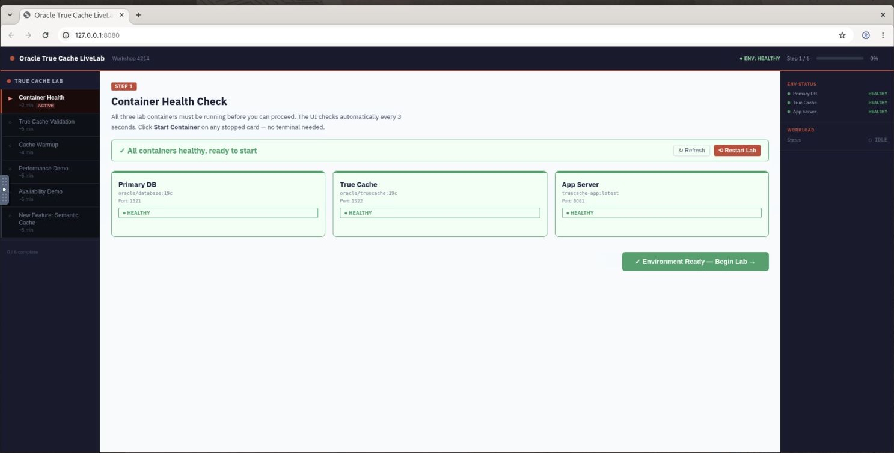
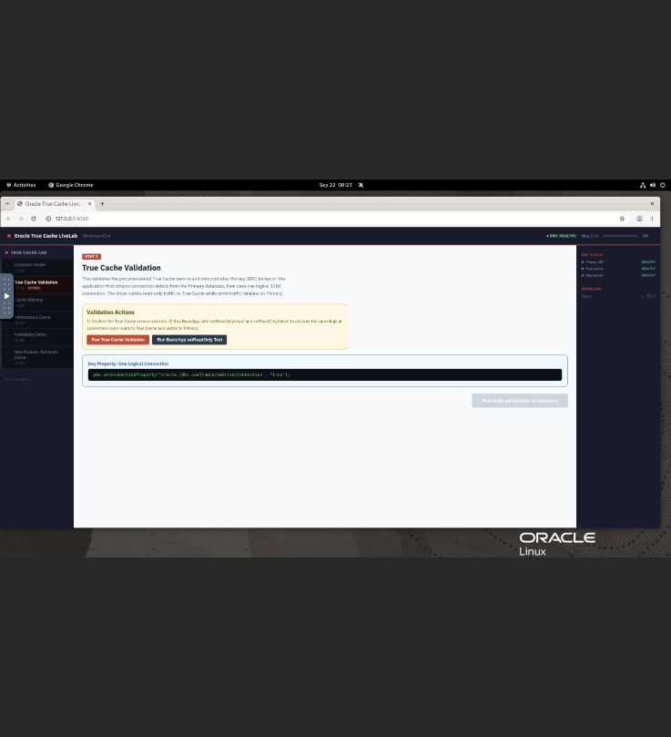
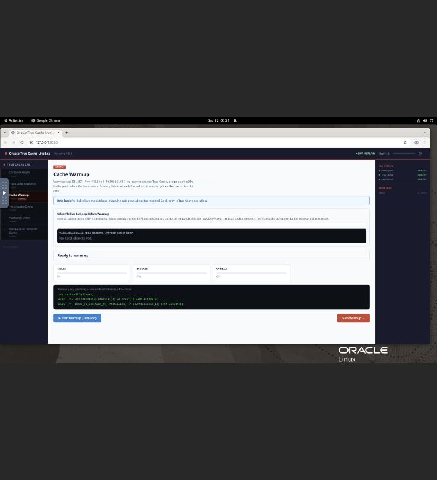
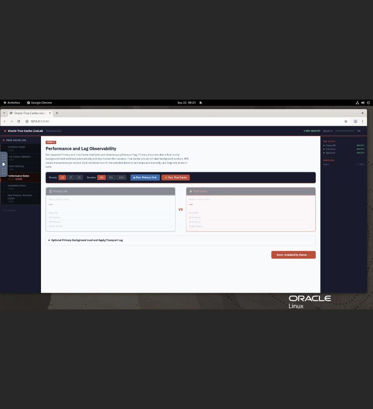
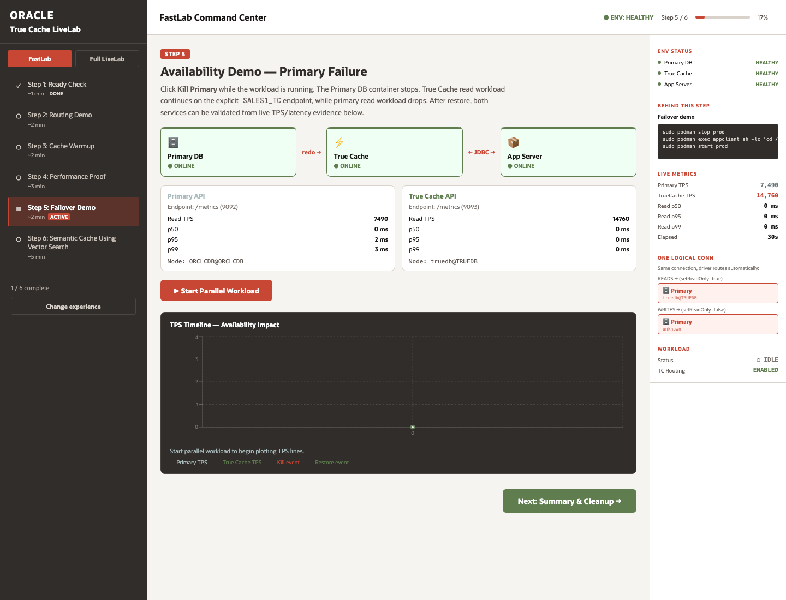
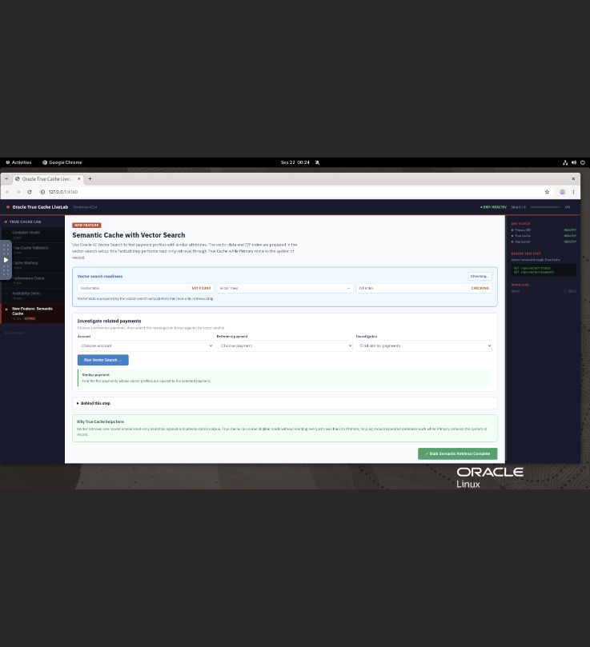

# FastLab: Quick Guided Demo

## Introduction

FastLab is a visual, six-step demonstration of Oracle True Cache. Open the command center and follow the guided flow. The command center uses the pre-provisioned transaction environment and runs the database checks, JDBC workloads, cache warmup, availability test, and vector searches through guided controls.

The environment contains the `TRANSACTIONS` schema with preloaded `ACCOUNTS`, `PAYMENTS`, and payment-vector sample data. FastLab performs the demonstration without requiring terminal commands or manual database setup.

Estimated Time: 25 minutes.

## Objectives

- Confirm that the Primary database, True Cache, and application server are healthy.
- See read-only work routed to True Cache through one logical connection.
- Keep and warm the transaction tables and indexes in True Cache.
- Compare Primary and True Cache read latency, with read throughput (TPS) as a supporting metric; optionally inspect replication and cache statistics while Primary receives background activity.
- Verify that True Cache can continue serving eligible read-only requests while the True Cache container and read service remain available during Primary downtime.
- Use semantic search to find similar payment profiles with Oracle AI Vector Search.

## Before You Begin

1. Open the LiveLabs desktop and launch the True Cache LiveLab UI.
2. Open `http://127.0.0.1:8080` in the LiveLabs desktop browser. FastLab opens directly.
3. Keep the command center open while completing each step. The right-hand panel shows environment health, the current workload, and the command or query being demonstrated behind the active step.

## FastLab Validation and Recovery

FastLab uses a host-level web proxy in addition to the `prod`, `truedb`, and `appclient` containers. The proxy is managed by `truecache-ui.service`.

### If the FastLab page does not open

1. In the LiveLabs desktop terminal, confirm that the UI port is listening:

    ```
    <copy>
    sudo ss -lntp | grep ':8080'
    </copy>
    ```

2. If there is no listener, check the UI service and start it if it is inactive:

    ```
    <copy>
    sudo systemctl status truecache-ui.service --no-pager
    if ! sudo systemctl is-active --quiet truecache-ui.service; then sudo systemctl start truecache-ui.service; fi
    </copy>
    ```

3. Refresh `http://localhost:8080` in the LiveLabs desktop browser.
4. If the page opens but the environment is unhealthy, continue with the container validation below and refresh the page after the containers recover.

### If a FastLab service is not healthy

1. Check all three containers:

    ```
    <copy>
    sudo podman ps -a --format 'table {{.Names}}\t{{.Status}}'
    </copy>
    ```

2. Start any stopped lab containers:

    ```
    <copy>
    sudo podman start prod truedb appclient
    </copy>
    ```

3. Wait for the database containers to report **healthy**, then refresh the FastLab page. Oracle database startup can take several minutes after a host restart.
4. The proxy starts the `SALES1` and `SALES1_TC` database services after the containers are healthy. If either service is still missing, use the idempotent service-start commands in Initialize Environment, Task 2, then refresh the page. If `start_service` reports `ORA-44305`, the service is already running and you can continue.
5. Do not begin the guided steps until **Primary DB**, **True Cache**, and **App Server** show **HEALTHY**.

If one of the named containers does not exist, stop the lab and contact the lab administrator. The instance does not contain the pre-provisioned environment required by FastLab.

## Task 1: Ready Check

1. Wait for the environment check to finish.
2. Confirm that **Primary DB**, **True Cache**, and **App Server** show **HEALTHY**.
3. Select **Next step**.

The environment is pre-provisioned. This step confirms that the services needed by the rest of the demonstration are available.



## Task 2: Routing Demo

1. Select **Run True Cache Validation**.
2. Select **Run BasicApp setReadOnly Test**.
3. Review the evidence panel.
4. Confirm that the read-only operation reaches True Cache and that the logical connection still uses Primary for write operations.
5. Select **Next step**.

This demonstrates the application behavior that makes True Cache transparent to the application: the application uses one connection, while the driver routes read-only work to True Cache and read-write work to Primary.



## Task 3: Cache Warmup

1. Select the checkbox for **ACCOUNTS** and **PAYMENTS**. Selecting a table applies KEEP immediately to that table and the indexes available for it.
2. Confirm that each selected table and its available indexes appear as **KEPT** in the object list. Leave `PAYMENT_VECTORS` unselected; the vector-search step prepares and uses it separately.
3. Select **Start Warmup (Java app)**.
4. Wait for the table, index, and overall progress indicators to complete.
5. Review the cached-data summary and object-wise cache breakdown.
6. Select **Next step**.

Keeping the objects tells True Cache which transaction tables and indexes to retain for the demonstration. The warmup reads the objects before the performance demonstration, so the comparison measures a useful cache-pool read path rather than an unpopulated cache.



## Task 4: Primary vs True Cache Performance and Lag

1. FastLab defaults to 10 threads and 30 seconds for both read runs; leave those values selected.
2. The optional Primary background read workload is **off by default**. Expand **Optional Primary Background Load and Apply/Transport Lag** only when you want additional read pressure on Primary. It defaults to four workers and stops automatically when its run completes; you can adjust the worker count and interval before selecting **Start Background Read Load**.
3. Select **Run: Primary Only** and review the Primary read latency, with TPS shown as a supporting metric.
4. Select **Run: True Cache** and review the True Cache read latency, with TPS shown as a supporting metric.
5. Compare the live read chart, latency cards/table, and supporting TPS values. With the optional background workload left off, the two read tests provide a direct comparison without additional Primary read pressure.
6. If you want to observe replication lag under write pressure, expand **Optional Primary Background Load and Apply/Transport Lag** and select **Start Write Load + Observe Lag**. It also defaults to four workers and stops automatically when its run completes; stop it early only if needed.
7. Review the expanded panel for:
   - Transport lag and apply lag from replication.
   - True Cache, RAM, and flash hit ratios.
   - Single-block, multiblock, and list-of-blocks fetch latency.
8. Select **Next step**.

Each read test runs for the selected duration and stops automatically. Both background workloads are manual and remain off unless started in the expanded panel; they are stopped when you leave the step or reset the lab.

The read comparison is intentionally shown separately from optional background activity. With the background workload off, both runs measure reads without additional Primary pressure. If you enable a background workload, Primary handles that activity while the True Cache read path can serve eligible kept data from its cache pool and receive the replicated changes.



## Task 5: Verify Availability: True Cache Can Continue Serving Eligible Reads During Primary Downtime

1. Select **Start Parallel Workload**. This starts separate read and write activity for the configured duration and stops automatically.
2. Select **Kill Primary DB**.
3. Confirm that Primary changes to an unavailable state while True Cache remains healthy.
4. Review the True Cache read TPS and the logical-connection status in the right-hand panel.
5. Select **Restore Primary**.
6. Wait for Primary and True Cache to return to **HEALTHY**.
7. Select **Next step**.

True Cache is a read-only replica. While the True Cache container and read service remain available and replicated data has been applied, it can continue serving eligible read-only requests during Primary downtime. Write operations and changes still require the Primary database. Primary is restored before the next step.



## Task 6: New Feature - Semantic Cache with Vector Search

1. Select a payment from the reference-payment list. The selected payment supplies the vector used for the search.
2. Choose an investigation:
   - **Find similar payments** compares payment profiles across the vector sample.
   - **Account behavior** restricts the candidates to the selected account.
   - **Cross-border similarity** restricts the candidates to a different country.
   - **Recent activity** restricts the candidates to recent payments.
   - **Similar amount profile** finds payments with a similar amount and vector profile.
3. Read the explanation below the investigation selector. It describes the filter and the vector query used for the selected payment.
4. Expand **Behind this step** to see the actual SQL and the True Cache route for the request.
5. Review the result table. FastLab returns the five closest matching payments.
6. Read **Vector distance** as a similarity score: a smaller cosine distance means the payment profiles point in a more similar direction. The distance is not a currency amount or a percentage.
7. Try another reference payment or investigation and compare how the candidate filter changes the results.

This step connects the existing payment workflow to Oracle AI Vector Search. This lab uses a deterministic 16-dimensional feature vector derived from payment attributes, including amount, account behavior, country, and transaction time. It is a demonstrative similarity representation. Vector retrieval is a read-heavy workload that can repeat similar searches against a relatively stable corpus. Routing eligible read-only retrieval through True Cache can reduce repeated reads against Primary, improve response time under concurrent search load, and leave Primary focused on transactional work. The Primary database remains the system of record for writes, ingestion, corpus refreshes, and freshness-sensitive operations.



## Completion

The FastLab is complete when:

- The Primary database, True Cache, and application server each show **HEALTHY**.
- The routing evidence identifies True Cache for read-only work.
- `ACCOUNTS` and `PAYMENTS`, including their selected indexes, show **KEPT**.
- Cache warmup completes and statistics are visible.
- Primary and True Cache read latency has been reviewed, with supporting TPS values.
- Replication lag, cache hit ratios, and fetch latency have been reviewed.
- True Cache remains available while Primary is stopped, and Primary is restored afterward.
- At least one vector investigation returns five ranked payment results and its SQL is visible in **Behind this step**.

## Learn More

[Oracle True Cache documentation](https://docs.oracle.com/en/database/oracle/oracle-database/23/odbtc/using-oracle-true-cache-your-applications.html)

## Acknowledgements

* **Authors** - Sambit Panda, Consulting Member of Technical Staff, Oracle Database Product Management
* **Contributors** - Pankaj Chandiramani, Shefali Bhargava, Jyoti Verma, Nithin Thekkupadam Narayanan, Sarvesh Gupta
* **Last Updated By/Date** - Sambit Panda, Consulting Member of Technical Staff, Sep 2026
