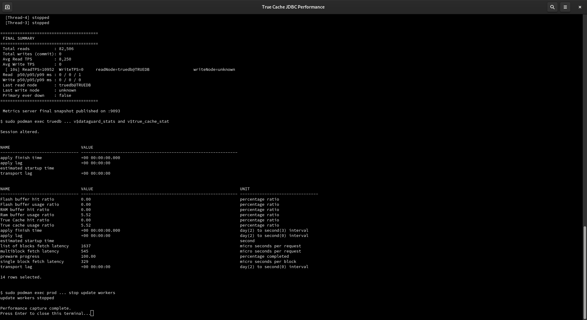
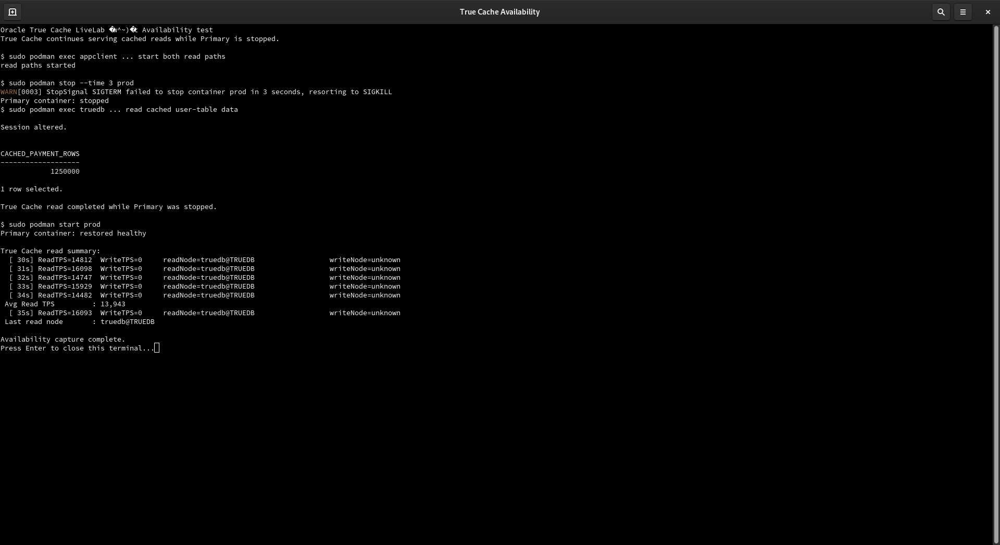

# Use True Cache through JDBC

## Introduction

This lab uses one logical JDBC connection for Primary and True Cache. Read-only work can be routed to True Cache, while read-write work remains on Primary. The lab compares read performance, observes replication statistics while Primary receives updates, and verifies that True Cache continues serving reads while Primary is stopped.

Estimated Time: 30 minutes.

The command-line path uses one application-container shell and one database-container shell at a time. After entering a container, run the following commands directly in that shell. Do not start another container shell for each command.

## Objectives

- Validate JDBC read routing.
- Compare Primary and True Cache read TPS and latency.
- Observe transport lag, apply lag, cache hit ratios, and fetch latency.
- Verify True Cache availability while Primary is stopped.
- Continue to the separate Semantic Cache Using Vector Search lab.

## Application Container Session

Open the application container once. Enter the password through the hidden prompt so it is not printed:

~~~text
<copy>
read -rsp 'Transactions password: ' DB_PASS; echo
sudo podman exec -e DB_PASS="$DB_PASS" -it appclient /bin/bash
cd /stage/clientapp
</copy>
~~~

Keep this application shell open through the routing, performance, and availability steps.

## Step 2: Routing Validation

### FastLab

1. Open **Step 2: Routing Demo**.
2. Select **Run True Cache Validation**.
3. Select **Run BasicApp setReadOnly Test**.
4. Review the routing evidence and continue.

### Full LiveLab

Run the supplied BasicApp from the application container:

~~~text
<copy>
cd /stage/clientapp/BasicApp
/stage/jdk-17.0.6/bin/java -cp ojdbc8.jar:. TrueCache 172.20.1.2:1521/sales1 transactions "$DB_PASS"
cd /stage/clientapp
</copy>
~~~

The result identifies the database role used by the read-only operation. The connection uses Primary for read-write work and can use True Cache for read-only work.

## Step 4: Primary vs True Cache Performance and Lag

### FastLab

1. Open **Step 4: Performance Proof**.
2. Keep the default thread and duration values.
3. FastLab starts the Primary background read/write activity before the comparison.
4. Select **Run: Primary Only** and review Primary read TPS.
5. Select **Run: True Cache** and review True Cache read TPS and latency.
6. Select **Run Parallel Comparison** and compare the read chart, TPS cards, and latency table.
7. Expand **Performance timelines** to review lag, hit ratios, and fetch latency.

### Full LiveLab

Start three update-only workers in a separate host terminal. Enter the Primary container once:

~~~text
<copy>
sudo podman exec -it prod /bin/bash
export ORACLE_SID=ORCLCDB
: > /tmp/tcwrite.pids
for worker in 1 2 3; do
  (
    while true; do
      printf '%s\n' "alter session set container=ORCLPDB1;" "update transactions.accounts set balance=balance+1,last_modified_utc=systimestamp where account_id between 1 and 25000;" "commit;" "exit" | sqlplus -s / as sysdba >/dev/null 2>&1
      sleep 0.15
    done
  ) &
  echo $! >> /tmp/tcwrite.pids
done
cat /tmp/tcwrite.pids
</copy>
~~~

These workers update existing ACCOUNTS rows. They do not add rows to the dataset.

From the application container shell, run the Primary read baseline:

~~~text
<copy>
cd /stage/clientapp
URL=172.20.1.2:1521/sales1 THREADS=10 DURATION=30 METRICS_PORT=9092 ./TransactionsApp.sh primary
</copy>
~~~

Run the same read workload directly against True Cache:

~~~text
<copy>
READ_ONLY_WORKLOAD=true DIRECT_READ_ONLY=true DISABLE_TRUECACHE_PROPERTY=true ALLOW_DIRECT_FALLBACK=true DIRECT_FALLBACK_URL=172.20.1.98:1521/SALES1_TC URL=172.20.1.98:1521/SALES1_TC THREADS=10 DURATION=30 METRICS_PORT=9093 ./TransactionsApp.sh truecache
</copy>
~~~

Run both read paths in parallel:

~~~text
<copy>
pkill -f '[T]ransactions_TrueCache' || true
URL=172.20.1.2:1521/sales1 THREADS=10 DURATION=60 METRICS_PORT=9092 ./TransactionsApp.sh primary >/tmp/primary-read.log 2>&1 &
PRIMARY_PID=$!
sleep 2
READ_ONLY_WORKLOAD=true DIRECT_READ_ONLY=true DISABLE_TRUECACHE_PROPERTY=true ALLOW_DIRECT_FALLBACK=true DIRECT_FALLBACK_URL=172.20.1.98:1521/SALES1_TC URL=172.20.1.98:1521/SALES1_TC THREADS=10 DURATION=60 METRICS_PORT=9093 ./TransactionsApp.sh truecache >/tmp/truecache-read.log 2>&1 &
TRUECACHE_PID=$!
wait "$PRIMARY_PID" "$TRUECACHE_PID"
grep -E 'ReadTPS|Read TPS|readNode' /tmp/primary-read.log /tmp/truecache-read.log | tail -20
</copy>
~~~

While the comparison runs, open another host terminal and enter True Cache once:

~~~text
<copy>
sudo podman exec -it truedb /bin/bash
export ORACLE_SID=TRUEDB
sqlplus / as sysdba
alter session set container=ORCLPDB1;
set pages 100 lines 240
select name, value from v$dataguard_stats where lower(name) in ('transport lag','apply lag') order by name;
select name, value, unit from v$true_cache_stat where lower(name) in ('true cache hit ratio','ram buffer hit ratio','flash buffer hit ratio','prewarm progress','apply finish time','apply lag','transport lag','estimated startup time','single block fetch latency','multiblock fetch latency','list of blocks fetch latency') order by name;
exit
exit
</copy>
~~~

Stop the update workers in the original Primary container shell:

~~~text
<copy>
kill $(cat /tmp/tcwrite.pids) 2>/dev/null || true
rm -f /tmp/tcwrite.pids
exit
</copy>
~~~

The workload output reports read TPS and read node values. The diagnostics show the replication and cache values used by the FastLab performance panel.

## Step 5: Availability - Primary Down, True Cache Still Serving

### FastLab

1. Open **Step 5: Failover Demo**.
2. Select **Start Comparison**.
3. Select **Stop Primary**.
4. Review True Cache read TPS while Primary is stopped.
5. Select **Restore Primary**.
6. Wait for Primary and True Cache to show **HEALTHY**.

### Full LiveLab

Use the application-container shell to start both read paths:

~~~text
<copy>
cd /stage/clientapp
pkill -f '[T]ransactions_TrueCache' || true
URL=172.20.1.2:1521/sales1 THREADS=10 DURATION=120 METRICS_PORT=9092 ./TransactionsApp.sh primary >/tmp/availability-primary.log 2>&1 &
PRIMARY_PID=$!
sleep 2
READ_ONLY_WORKLOAD=true DIRECT_READ_ONLY=true DISABLE_TRUECACHE_PROPERTY=true ALLOW_DIRECT_FALLBACK=true DIRECT_FALLBACK_URL=172.20.1.98:1521/SALES1_TC URL=172.20.1.98:1521/SALES1_TC THREADS=10 DURATION=120 METRICS_PORT=9093 ./TransactionsApp.sh truecache >/tmp/availability-truecache.log 2>&1 &
TRUECACHE_PID=$!
pgrep -af '[T]ransactions_TrueCache'
</copy>
~~~

Use the host terminal to stop Primary:

~~~text
<copy>
sudo podman stop --time 3 prod
sudo podman ps --format 'table {{.Names}}\t{{.Status}}'
</copy>
~~~

Enter True Cache once and verify its role and read service:

~~~text
<copy>
sudo podman exec -it truedb /bin/bash
export ORACLE_SID=TRUEDB
sqlplus / as sysdba
set pages 100 lines 180
select database_role, open_mode from v$database;
alter session set container=ORCLPDB1;
select name, network_name from v$services where name='SALES1_TC';
exit
exit
</copy>
~~~

Review the True Cache read workload from the application container shell:

~~~text
<copy>
grep -E 'ReadTPS|Read TPS|readNode' /tmp/availability-truecache.log | tail -20
</copy>
~~~

Restore Primary from the host terminal:

~~~text
<copy>
sudo podman start prod
sleep 20
sudo podman ps --format 'table {{.Names}}\t{{.Status}}'
</copy>
~~~

Enter Primary once and confirm its role and service:

~~~text
<copy>
sudo podman exec -it prod /bin/bash
export ORACLE_SID=ORCLCDB
sqlplus / as sysdba
set pages 100 lines 180
select database_role, open_mode from v$database;
alter session set container=ORCLPDB1;
select name, network_name from v$services where name='SALES1';
exit
exit
</copy>
~~~

Return to the application container shell and finish both read workloads:

~~~text
<copy>
wait "$PRIMARY_PID" "$TRUECACHE_PID"
exit
</copy>
~~~

## Next Lab

Continue to [Semantic Cache Using Vector Search](../vector-search/vector-search_dbw26.md) for the native vector table, embedding, index, and payment investigation queries.

## Learn More

[Oracle True Cache documentation](https://docs.oracle.com/en/database/oracle/oracle-database/23/odbtc/using-oracle-true-cache-your-applications.html)

## Acknowledgements

* **Authors** - Sambit Panda, Consulting Member of Technical Staff, Oracle Database Product Management
* **Contributors** - Pankaj Chandiramani, Shefali Bhargava, Jyoti Verma, Nithin T N
* **Last Updated By/Date** - Sambit Panda, Consulting Member of Technical Staff, Sep 2026
