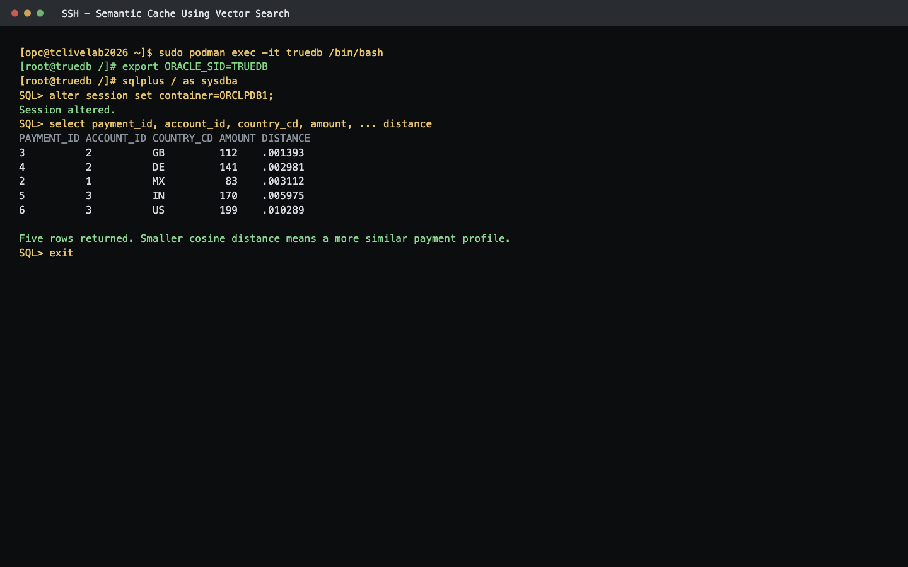

# Semantic Cache Using Vector Search

## Introduction

This lab adds semantic retrieval to the existing TRANSACTIONS payment workflow. The vector table is built from PAYMENTS, so the search results remain natural to the current schema. The query runs against True Cache and returns the most similar payment profiles.

The environment includes a 20,000-row PAYMENT_VECTORS sample. The commands below also show how to create the table, generate embeddings, and create the vector index from the existing payment data.

Estimated Time: 15 minutes.

## Objectives

- Create a native Oracle vector table in the TRANSACTIONS schema.
- Generate 16-dimension payment embeddings from existing payment attributes.
- Create a cosine IVF vector index.
- Run similar-payment, account-behavior, and cross-border queries through True Cache.
- Understand why the result is the top five rows and how to read cosine distance.

## Step 6: Semantic Cache Using Vector Search

### FastLab

1. Open **Semantic Cache Using Vector Search**.
2. Select a payment from the payment list.
3. Choose one investigation:
   - **Find similar payments:** nearest profiles across the vector sample.
   - **Account behavior:** nearest profiles from the same account.
   - **Cross-border risk:** nearest profiles from another country.
   - **Recent activity:** nearest profiles from the last 30 days.
   - **Similar amount profile:** payments with a similar amount and vector profile.
4. Review the SQL shown in **Behind this step**.
5. Read the distance column. A smaller cosine distance means a more similar vector profile.
6. Confirm that the result is routed through True Cache.

### Full LiveLab

Run the following commands in the host terminal. The database commands use SYSDBA authentication inside the database containers, so no database password is placed in a command or displayed on screen.

Open Primary SQL*Plus:

~~~text
<copy>
podman exec -it prod /bin/bash
export ORACLE_SID=ORCLCDB
sqlplus / as sysdba
alter session set container=ORCLPDB1;
</copy>
~~~

Review the payment attributes that will be represented in the vector:

~~~text
<copy>
select id, account_id, country_cd, amount, created_utc
from transactions.payments
fetch first 10 rows only;
</copy>
~~~

Create the native vector table. The PL/SQL block leaves an existing table in place and creates it when the lab is initialized from an empty schema:

~~~text
<copy>
begin
  execute immediate 'create table TRANSACTIONS.PAYMENT_VECTORS (payment_id number primary key, account_id number, country_cd varchar2(8), amount number, created_utc timestamp, embedding vector(16, float32))';
exception
  when others then
    if sqlcode != -955 then raise; end if;
end;
/
</copy>
~~~

Generate the 16-dimension embedding from the existing payment fields. The first dimensions represent amount, account, country, and transaction time. The stable hash dimensions distinguish otherwise similar payment rows:

~~~text
<copy>
merge into TRANSACTIONS.PAYMENT_VECTORS target
using (
  select id, account_id, country_cd, amount, created_utc,
    to_vector('[' ||
      to_char(least(greatest(amount,0)/1000,1),'FM0.000') || ',' ||
      to_char(mod(account_id,1000)/1000,'FM0.000') || ',' ||
      to_char(ascii(substr(country_cd,1,1))/255,'FM0.000') || ',' ||
      to_char(ascii(substr(country_cd,2,1))/255,'FM0.000') || ',' ||
      to_char(extract(month from created_utc)/12,'FM0.000') || ',' ||
      to_char(extract(day from created_utc)/31,'FM0.000') || ',' ||
      to_char(extract(hour from created_utc)/24,'FM0.000') || ',' ||
      to_char(mod(id,997)/997,'FM0.000') || ',' ||
      to_char(mod(account_id,97)/97,'FM0.000') || ',' ||
      to_char(mod(id,89)/89,'FM0.000') ||
      ',0.100,0.080,0.060,0.050,0.040,0.030]') embedding
  from TRANSACTIONS.PAYMENTS
  where rownum <= 20000
) source
on (target.payment_id = source.id)
when not matched then insert
  (payment_id, account_id, country_cd, amount, created_utc, embedding)
  values
  (source.id, source.account_id, source.country_cd, source.amount, source.created_utc, source.embedding);
commit;
select count(*) vector_rows from TRANSACTIONS.PAYMENT_VECTORS;
</copy>
~~~

Create the cosine IVF vector index:

~~~text
<copy>
begin
  execute immediate 'create vector index TRANSACTIONS.PAYMENT_VECTORS_IVF_IDX on TRANSACTIONS.PAYMENT_VECTORS (embedding) organization neighbor partitions distance cosine with target accuracy 90';
exception
  when others then
    if sqlcode not in (-955, -1408) then raise; end if;
end;
/
select index_name, index_type, status
from dba_indexes
where owner = 'TRANSACTIONS'
  and index_name = 'PAYMENT_VECTORS_IVF_IDX';
</copy>
~~~

Select a reference payment:

~~~text
<copy>
select payment_id, account_id, country_cd, amount
from TRANSACTIONS.PAYMENT_VECTORS
fetch first 1 row only;
</copy>
~~~

Leave the Primary SQL*Plus session and container:

~~~text
<copy>
exit
exit
</copy>
~~~

Run the nearest-neighbor query through True Cache. Replace 1 with the payment ID returned above:

~~~text
<copy>
podman exec -it truedb /bin/bash
export ORACLE_SID=TRUEDB
sqlplus / as sysdba
set pages 100 lines 220
alter session set container=ORCLPDB1;
select payment_id, account_id, country_cd, amount,
       round(vector_distance(embedding,
         (select embedding from TRANSACTIONS.PAYMENT_VECTORS where payment_id=1),
         cosine), 6) distance
from TRANSACTIONS.PAYMENT_VECTORS
where payment_id <> 1
order by vector_distance(embedding,
  (select embedding from TRANSACTIONS.PAYMENT_VECTORS where payment_id=1), cosine)
fetch first 5 rows only;
</copy>
~~~

This is a nearest-neighbor query. It compares each payment embedding with the selected payment embedding, sorts by cosine distance, and returns the top five rows. A smaller distance means that the numeric profiles are more similar.

Run the account behavior query:

~~~text
<copy>
set pages 100 lines 220
select payment_id, account_id, country_cd, amount,
       round(vector_distance(embedding,
         (select embedding from TRANSACTIONS.PAYMENT_VECTORS where payment_id=1),
         cosine), 6) distance
from TRANSACTIONS.PAYMENT_VECTORS
where account_id = (select account_id from TRANSACTIONS.PAYMENT_VECTORS where payment_id=1)
  and payment_id <> 1
order by vector_distance(embedding,
  (select embedding from TRANSACTIONS.PAYMENT_VECTORS where payment_id=1), cosine)
fetch first 5 rows only;
</copy>
~~~

This query narrows the candidate set to the selected account and then ranks its payments by vector similarity. It demonstrates account behavior without changing the source PAYMENTS table.

Run the cross-border risk query:

~~~text
<copy>
set pages 100 lines 220
select payment_id, account_id, country_cd, amount,
       round(vector_distance(embedding,
         (select embedding from TRANSACTIONS.PAYMENT_VECTORS where payment_id=1),
         cosine), 6) distance
from TRANSACTIONS.PAYMENT_VECTORS
where country_cd <> (select country_cd from TRANSACTIONS.PAYMENT_VECTORS where payment_id=1)
order by vector_distance(embedding,
  (select embedding from TRANSACTIONS.PAYMENT_VECTORS where payment_id=1), cosine)
fetch first 5 rows only;
exit
exit
</copy>
~~~

This query looks for similar payment profiles from another country. The country filter provides the investigation scope and the vector distance provides the ranking inside that scope.

## Completion

The lab is complete when:

- PAYMENT_VECTORS contains the payment embedding sample.
- PAYMENT_VECTORS_IVF_IDX is present.
- The similar-payment query returns five rows through True Cache.
- The account behavior query returns the closest rows for the selected account.
- The cross-border query returns the closest rows from another country.
- The SQL and distance value are understood for each search.
